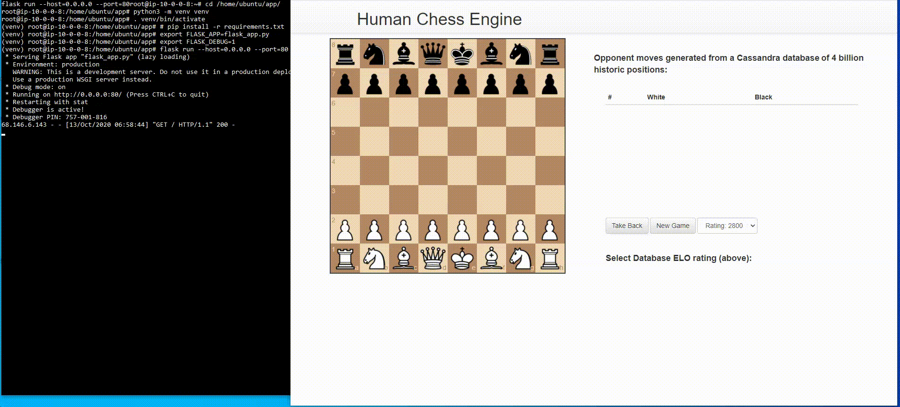
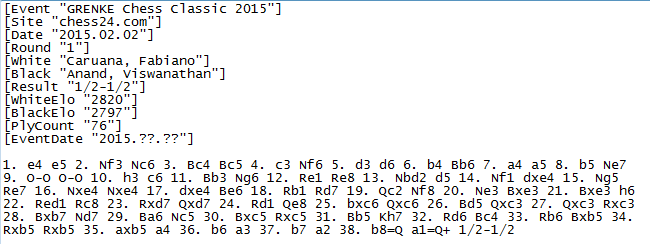
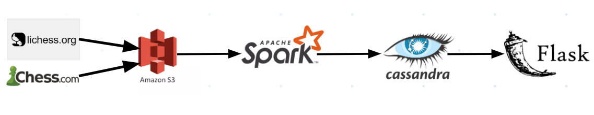

<p align="center">
    
</p>

# Human Chess Engine: Play Chess Against a Database
## Insight Data Engineering  
Presentation slides located at [this link](https://docs.google.com/presentation/d/1T-4T8UEvlTqryb12pExy90lKWwECutIUUivGWsC7EtM/edit?usp=sharing)

## Setup Instructions
1. Data ingestion into S3:
    + Procedure to download data from lichess.org found in **./data-ingestion/s3_load_lichess.sh**
    + Procedure to scrape chess games from Chess.com found in **./data-ingestion/s3_load_chesscom.sh**
2. Setup Spark Cluster on EC2 (the steps I followed are found in  **./bash/spark_setup.sh**)
3. Setup Cassandra Cluster on EC2 (the steps I followed are found in  **./bash/cassandra_setup.sh**)
4. Run Spark PySpark job following **./bash/run_spark.sh**). Call one of the following ETL scripts:
    +  **./data-processing/chesscom-etl.py** to process data from Chess.com
    +  **./data-processing/lichess-etl.py** to process data from lichess.org
5. Check Cassandra tables following **./bash/run_cassandra.sh**
6. Launch Flask app by following **./bash/run_flask.sh**

## Motivation
About 20 million users are active on the top three online chess platforms. The main ways that people play are:
- Human vs human
- Human vs chess engine (ex: Stockfish)
- Human vs Artificial Intelligence (if you want to lose real bad. ex: Google DeepMind's AlphaZero)

However, I wanted a new way to play: to play against all the humans that have ever played before.

## Solution
Play chess against a historic database! The user makes their move.  
The database returns the **most common next move.**  
The **recorded presentation** is here: [Youtube Presentation Link](https://www.youtube.com/watch?v=t3KEKx6tMcY)  
The **website** of the Flask app had to be taken down due to the budget.  

## Flask Chess App Demo (showing frontend and backend)
<p align="center">
    
</p>

## Dataset
- 1.5 billion games from [lichess.org](https://database.lichess.org/)
- [Chess.com API](https://www.chess.com/news/view/published-data-api) (Over 1 billion games stored)  
- **NOTE:** Due to the three week timeframe, I was able to get 100 million games processed.
- This works out to **4 billion historic board configurations** (about 1 TB of data)

## PGN Files
Chess games are stored in Portable Game Notation (PGN) files. Below is a sample file from 1 game:


## Data Pipeline
  
**NOTE:** The Flask frontend was based on *brokenloop's* repo: https://github.com/brokenloop/FlaskChess. 

## Cassandra Data Model
Two tables were stored in Cassandra:
- **games:** one row for each game (**100 million rows**)
    + *event, white, black, result, eco, opening, whiteelo, blackelo, timecontrol, termination, gameid, moves, datetime, timestamp*
- **moves:** one row for each move (**4 billion rows**)
    + *gameid, result, whiteelo, blackelo, timecontrol, move, board_state, move_no*

## Cassandra Query
Cassandra gives excellent query speed if the type of query is *always the same and has no aggregations.*
To accomplish the query, the **moves** table needed the following **Primary Key:**
- **Partition Column:** board_state
- **Clustering Columns:** blackelo, gameid 

After processing in Spark, the Cassandra query used to generate the moves was actually quite simple:
```
SELECT moves, blackelo FROM chessdb.moves
WHERE board_state = 'BOARD_STATE_FEN' 
AND blackelo > {ratingmin} AND blackelo < {ratingmax}
```

### Query Speed  
First 2 moves: about **10 seconds**
After move 4: **less than 1 second**

## Demo Links
- 40 second screencast of the Flask Chess App functionality: [Youtube Demo Link](https://www.youtube.com/watch?v=Wm0CyzB7CR4)
- 6 minute screencast of presentation, plus Flask App, WITH commentary: [Youtube Presentation Link](https://www.youtube.com/watch?v=t3KEKx6tMcY)

## Future Production Improvements
- Attach Airflow to continuously expand the database. Will improve the user experience and minimize query “no results”
- Create another Cassandra table to allow the option of playing as the black pieces